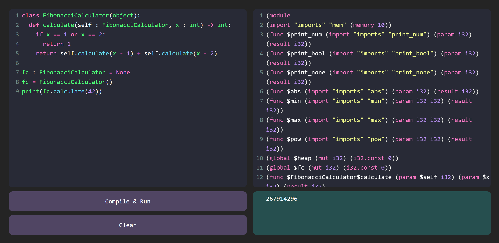

# Py2Wasm

A mini Python to WebAssembly compiler, currently supporting a subset of ChocoPy syntax. This is an ongoing extension of the CSE231 project.

You can play with the demo [here](https://arthur-x.github.io/Py2Wasm/).

